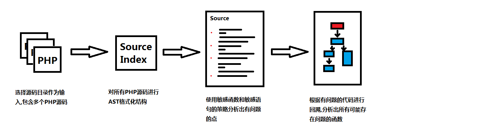
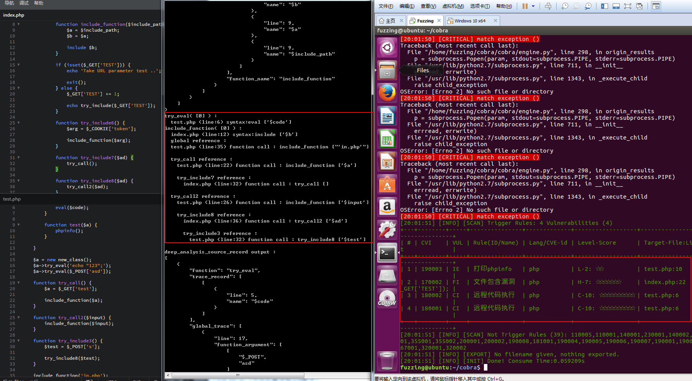
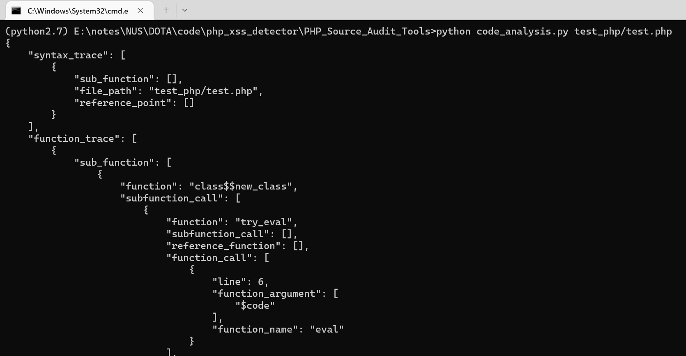

## PHP_Source_Audit_Tools

  Just for Fun .
  
  去年写的白盒自动化审计工具,原理是定位到敏感函数之后,再对函数所使用的参数进行回溯,跟踪到$_GET $_REQUEST 这些可以控制的输入点,但是由于PHP 语法糖和代码的问题,导致分析结果会有所出入,测试效果不错,但是实战效果不佳,故开源它的源码,有机会的话写一篇文章来说说自动化源码漏洞挖掘分析
  
  原理
  

  
## Example


  
  
## USE

remember to use python2 and pip

```shell
python code_analysis.py test_php/test.php
```



```json
{
    "syntax_trace": [
        {
            "sub_function": [
                {
                    "function": "include_function",
                    "reference_function": [
                        {
                            "function": "try_include6",
                            "subfunction_call": [],
                            "reference_function": [],
                            "function_call": [
                                {
                                    "line": 28,
                                    "function_argument": [
                                        "$arg"
                                    ],
                                    "function_name": "include_function"
                                }
                            ],
                            "reference_point": []
                        }
                    ],
                    "function_call": [
                        {
                            "line": 12,
                            "syntax_argument": [
                                "$b"
                            ],
                            "syntax": "include"
                        }
                    ],
                    "reference_point": [
                        {
                            "subfunction_call": [],
                            "reference_point": [
                                {
                                    "line": 39,
                                    "function_argument": [
                                        [
                                            "$_GET",
                                            "php"
                                        ]
                                    ],
                                    "function_name": "include_function"
                                },
                                {
                                    "line": 40,
                                    "function_argument": [
                                        "'123.php'"
                                    ],
                                    "function_name": "include_function"
                                }
                            ],
                            "function_call": [],
                            "function_name": "__global"
                        }
                    ]
                }
            ],
            "file_path": "test_php/index.php",
            "reference_point": []
        }
    ],
    "function_trace": [
        {
            "sub_function": [],
            "file_path": "test_php/index.php",
            "reference_point": []
        }
    ]
}
source_trace_record_data_stream_trace output :
{
    "function": [],
    "syntax": [
        {
            "function": "include_function",
            "trace_record": [
                [
                    {
                        "line": 10,
                        "name": "$b"
                    },
                    {
                        "line": 9,
                        "name": "$a"
                    },
                    {
                        "line": 8,
                        "name": "$include_path"
                    }
                ]
            ],
            "reference_point": [
                {
                    "subfunction_call": [],
                    "reference_point": [
                        {
                            "line": 39,
                            "function_argument": [
                                [
                                    "$_GET",
                                    "php"
                                ]
                            ],
                            "function_name": "include_function"
                        },
                        {
                            "line": 40,
                            "function_argument": [
                                "'123.php'"
                            ],
                            "function_name": "include_function"
                        }
                    ],
                    "function_call": [],
                    "function_name": "__global"
                }
            ],
            "file_name": "test_php/index.php",
            "trace_argument_point": [
                0
            ],
            "function_call": [
                {
                    "line": 12,
                    "syntax_argument": [
                        "$b"
                    ],
                    "syntax": "include"
                }
            ],
            "sub_function_trace": [
                [
                    {
                        "function": "try_include6",
                        "trace_record": [
                            [
                                {
                                    "line": 26,
                                    "name": [
                                        "$_COOKIE",
                                        "token"
                                    ]
                                }
                            ]
                        ],
                        "reference_point": [],
                        "file_name": "test_php/index.php",
                        "trace_argument_point": [],
                        "sub_function_trace": []
                    }
                ]
            ]
        }
    ]
}
deep_source_trace_record output :
{
    "function": [
        {
            "sub_function": [],
            "file_path": "test_php/index.php",
            "reference_point": []
        }
    ],
    "syntax": [
        {
            "sub_function": [
                {
                    "function": "include_function",
                    "reference_function": [
                        {
                            "function": "try_include6",
                            "subfunction_call": [],
                            "reference_function": [],
                            "function_call": [
                                {
                                    "line": 28,
                                    "function_argument": [
                                        "$arg"
                                    ],
                                    "function_name": "include_function"
                                }
                            ],
                            "reference_point": []
                        }
                    ],
                    "function_call": [
                        {
                            "line": 12,
                            "syntax_argument": [
                                "$b"
                            ],
                            "syntax": "include"
                        }
                    ],
                    "reference_point": [
                        {
                            "subfunction_call": [],
                            "reference_point": [
                                {
                                    "line": 39,
                                    "function_argument": [
                                        [
                                            "$_GET",
                                            "php"
                                        ]
                                    ],
                                    "function_name": "include_function"
                                },
                                {
                                    "line": 40,
                                    "function_argument": [
                                        "'123.php'"
                                    ],
                                    "function_name": "include_function"
                                }
                            ],
                            "function_call": [],
                            "function_name": "__global"
                        }
                    ]
                }
            ],
            "file_path": "test_php/index.php",
            "reference_point": []
        }
    ]
}
include_function( [0] ) :
  test_php/index.php (line:12) syntax:include ['$b']
deep_analysis_source_record output :
[
    {
        "function": "include_function",
        "trace_record": [
            [
                {
                    "line": 10,
                    "name": "$b"
                },
                {
                    "line": 9,
                    "name": "$a"
                },
                {
                    "line": 8,
                    "name": "$include_path"
                }
            ]
        ],
        "global_trace": [
            {
                "line": 39,
                "function_argument": [
                    [
                        "$_GET",
                        "php"
                    ]
                ],
                "function_name": "include_function"
            }
        ],
        "file_name": "test_php/index.php",
        "trace_point": [
            0
        ],
        "trace_link": [
            {
                "function": "try_include6",
                "line": 26,
                "function_argument": [
                    "$_COOKIE",
                    "token"
                ]
            }
        ]
    }
]
```